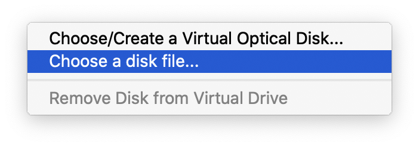

# Born2beroot

## Introduction

Born2beroot is a 42 proyect in which the student must install and configure a Linux OS following some stricted rules in a virtual machine (VirtualBox).

I chose to use Debian as I am an absolute begginer. The rules are:

- Create at least 2 partitions using LVM.
- Run SSH service only on port 4242.
- Cannot be conected by SSH as root.
- Configure OS using UFW firewall.
- Let 4242 be the only port opened.
- VM's hostname must be the student's login finished in 42 (cde-la-r42).
- Strong password policy implementation:
	- Password must expire every 30 days.
	- Allowed to change the password at least 2 days after the last change.
	- Message to the user 7 days before its password expires.
	- Minimun length is 10 characters.
	- Must contain at least one uppercase, one lowercase and one digit.
	- Must not contain more than 3 consecutive characters.
	- Must not contain the user's name.
	- Must contain at least 7 characters not cointained in the previous password (not for root).
- Install and configure sudo following strict rules.
	- Maximum 3 tries to write the correct passsword.
	- Custom message in case of a wrong password.
	- Register input and output in /var/log/sudo for each command run with sudo.
	- Set TTY to on.
	- Usable directories restricted.
- Create a new user with the student's name (apart from root).
- Make that user belong to user42 and sudo groups.
- Create a monitoring.sh script in bash which shows every 10 minutes the following information in all terminals:
	- OS architecture and kernel.
	- Number of physical cores.
	- Number of virtual cores.
	- Available RAM in server and usage percentage.
	- Available memory in server and usage percentage.
	- Cores' usage percentage.
	- Date and time from the last restart.
	- LVM usage status.
	- Number of active connections.
	- Numer of users on the server.
	- IPv4 address on the server and its MAC.
	- Number of sudo commands run.

## Steps

### VM Download

1. Download [Debian ISO](https://www.debian.org/distrib/netinst) (I chose debian 12.2.0 amd64).

### VM Installation
1. Open VirtuaBox, click on New.

2. Select name, folder and OS type and version.

3. Choose RAM size.

4. Choose "Create a virtual hard disk now".

5. Choose a VDI.

6. Choose "Dynamically allocated".

7. Select 30 GB.

8. Click on "Settigs".

9. Click on "Storage".

10. Click on "Empty" (disk emoji).

11. Click on disk emoji next to "Optical drive" and on "Choose a disk file...".

13. Select Debian ISO download.

14. Click on "OK".

15. Start virtual machine.

### VM Installation

